

  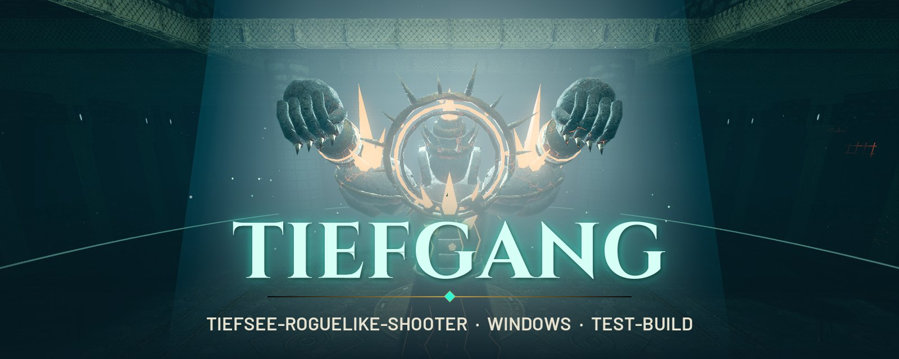

  <b>Pazifik, 1887. Unter dem Meeresboden liegen die Ruinen der Thalassari – und das größte Abyssalit-Vorkommen aller Zeiten.</b> 
  Steig im Messing-Taucheranzug hinab, kämpf dich Raum für Raum durch leuchtende Ruinen in erdrückender Dunkelheit 
  und bau dir mit jedem Raum einen stärkeren, verrückteren Build. Bis etwas am Grund aufwacht.

  
  
  

  <a href="https://osugerman.github.io/Tiefgang-Releases/"><b>Projektseite</b></a> ·
  <a href="#download--installation">Installation</a> ·
  <a href="#steuerung">Steuerung</a> ·
  <a href="#galerie">Galerie</a> ·
  <a href="#about--download-english">English</a>

---

## Trailer

<!-- TRAILER -->
<!-- Hier den Trailer einsetzen: Vorschaubild (media/trailer_preview.jpg) durch ein Standbild des Trailers ersetzen
     und den Link (href) auf das Video setzen, z. B. YouTube-URL oder eine MP4 aus einem Release. -->

  <a href="https://github.com/OsuGerman/Tiefgang-Releases/releases/latest">
    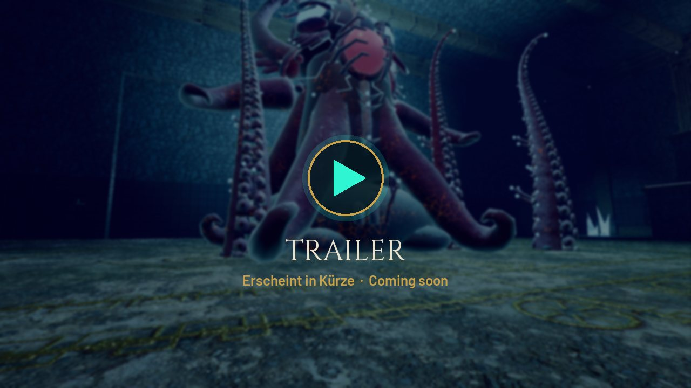
  </a>

<!-- /TRAILER -->

## Das Spiel

**TIEFGANG** ist ein schneller Ego-Shooter mit Roguelike-Runs. Jede Expedition führt dich linear durch 14 Tiefen – Kampfräume, Schatzkammern, Prüfungen und Bossarenen – bis hinunter in den Abgrund. Stillstand ist tödlich: Sprints, Dashes und Doppelsprünge sind deine wichtigste Verteidigung. Zwischen den Tauchgängen kehrst du in dein U-Boot zurück, forschst, rüstest auf und tauchst erneut.

### Features

- **5 Gebiete** – Tempelvorhof und Bohrstation als Startgebiete, danach Korallenkathedrale, Versunkene Archive und der Abgrund. Jedes mit eigener Architektur, Atmosphäre, eigenen Gegnern und Gefahren.
- **Bosse mit Phasen** – Xal-Tuun, die Bohrmutter, Ysmera, der Archivar, die Herolde und das Ohr des Schläfers. Jeder Boss mit eigenem Auftritt, Phasenwechseln und Schwachstellen.
- **Waffen und Fähigkeiten** – 9 Waffen vom Gouverneur bis zur Stimme der Tiefe, jede mit Sekundärfeuer und aktivem Nachladen, dazu 6 Fähigkeiten wie Wachposten, Phasensprung oder Anker-Slam.
- **Charms und Segen** – 50 Charms, die sich stapeln und kombinieren, und 21 Segen mit Element-Effekten (Flut, Blut, Blitz, Leere) und Reaktionen. Absurde Builds sind ausdrücklich erwünscht.
- **Roguelike-Runs mit 14 Tiefen** – jeder Run neu zusammengesetzt, Raum für Raum stärker, Belohnungen nach jeder Arena. Ein voller Tauchgang dauert etwa 25–40 Minuten.
- **U-Boot-Hub** – dein Stützpunkt zwischen den Expeditionen: Werkbank, Forschungstisch, Waffenständer, Reliquienschrein und Kodex.
- **Koop in Vorbereitung** – gemeinsam mit bis zu vier Tiefgängern abtauchen ist geplant und wird schrittweise eingebaut.

## Galerie

<table>
  <tr>
    <td width="50%"><a href="media/boss_xal_tuun.jpg">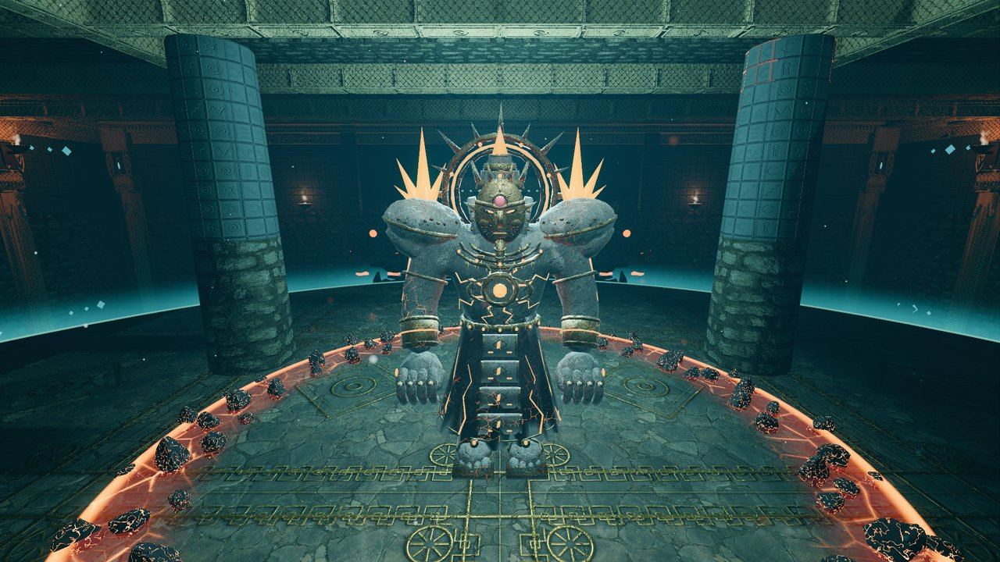</a></td>
    <td width="50%"><a href="media/boss_ysmera.jpg">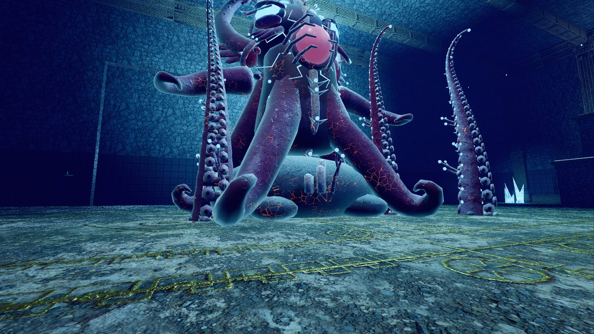</a></td>
  </tr>
  <tr>
    <td><a href="media/korallenkathedrale.jpg">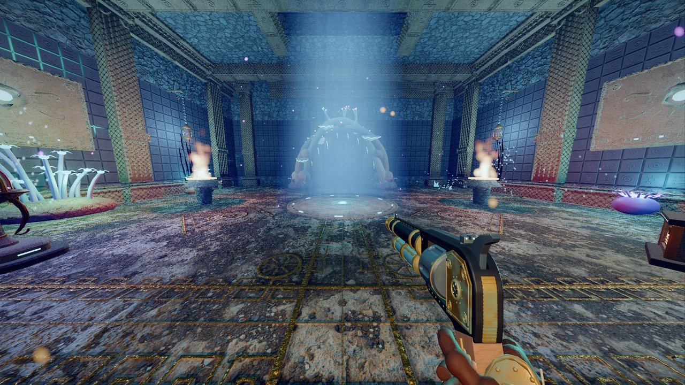</a></td>
    <td><a href="media/abgrund_portal.jpg">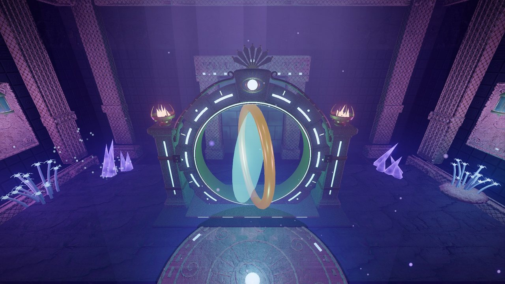</a></td>
  </tr>
  <tr>
    <td><a href="media/bosskampf_hud.jpg">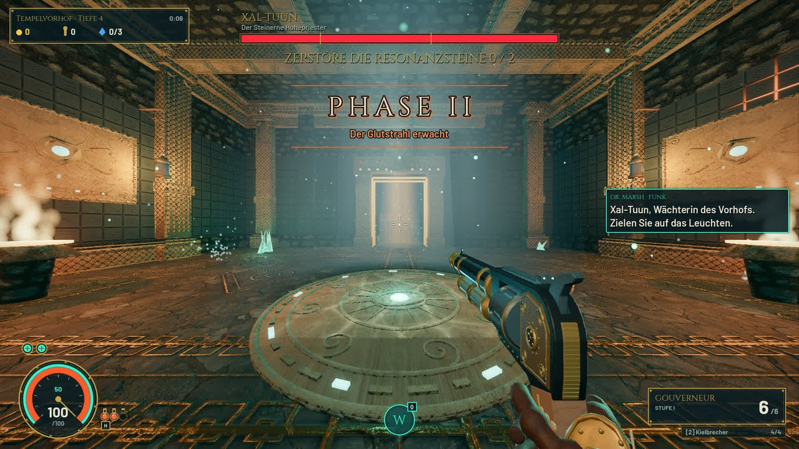</a></td>
    <td><a href="media/boss_bohrmutter.jpg">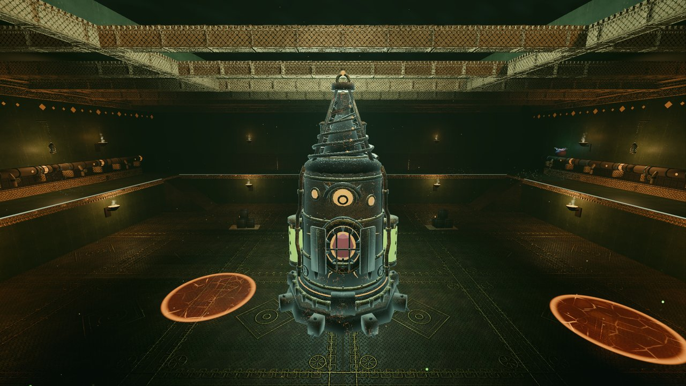</a></td>
  </tr>
  <tr>
    <td><a href="media/versunkene_archive.jpg">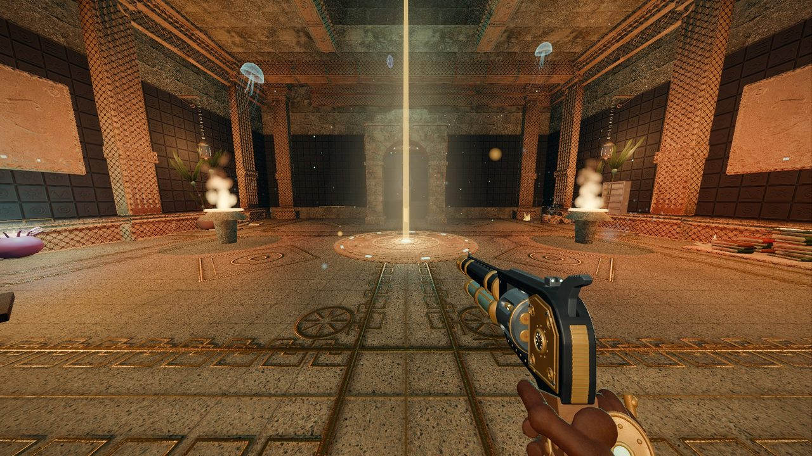</a></td>
    <td><a href="media/uboot_tauchkammer.jpg">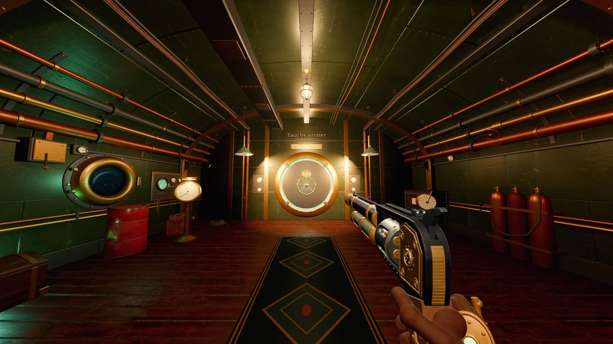</a></td>
  </tr>
  <tr>
    <td><a href="media/boss_archivar.jpg">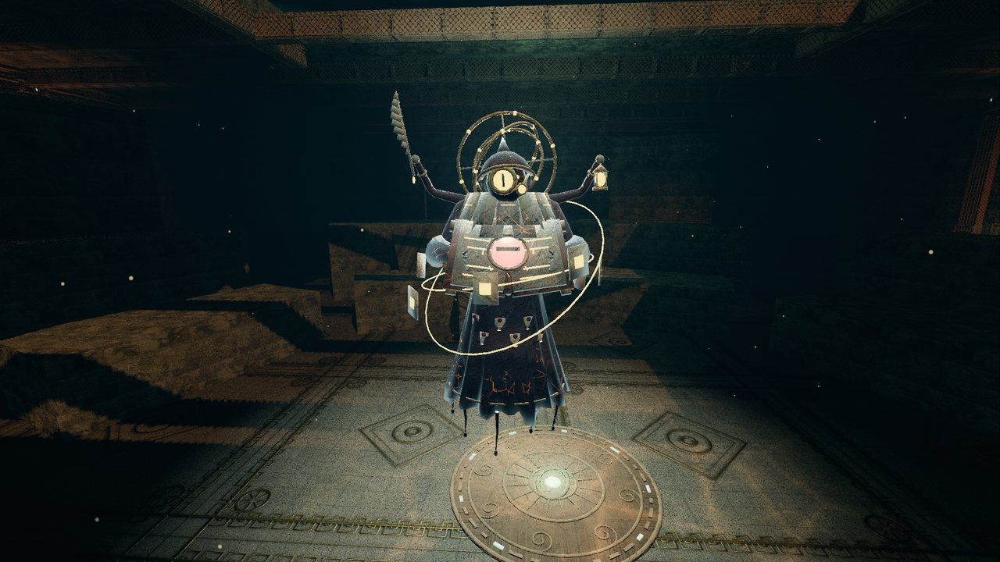</a></td>
    <td><a href="media/hauptmenue.jpg">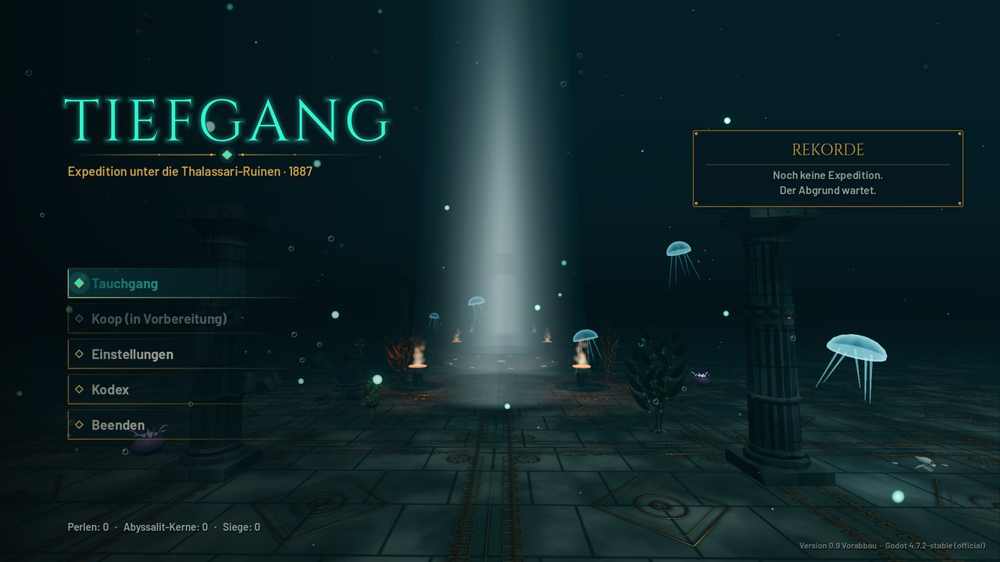</a></td>
  </tr>
</table>

Weitere Bilder auf der [Projektseite](https://osugerman.github.io/Tiefgang-Releases/). Alle Bilder sind echte Aufnahmen aus dem aktuellen Test-Build.

## Download & Installation

1. **[Tiefgang-Windows.zip herunterladen](https://github.com/OsuGerman/Tiefgang-Releases/releases/latest/download/Tiefgang-Windows.zip)** (neuester Test-Build, alle Versionen unter [Releases](https://github.com/OsuGerman/Tiefgang-Releases/releases)).
2. Den Ordner `Tiefgang` dorthin entpacken, wo du schreiben darfst, z. B. Desktop oder Dokumente. **Nicht** nach `C:\Programme`, sonst funktioniert das Auto-Update nicht.
3. `Tiefgang.exe` starten. Meldet Windows „Der Computer wurde durch Windows geschützt“: **Weitere Informationen → Trotzdem ausführen** (der Test-Build ist nicht signiert).

### Auto-Update

Beim Start prüft das Hauptmenü, ob es einen neueren Test-Build gibt. Wenn ja, erscheint unten rechts **„Neuer Test-Build verfügbar“ → „Jetzt aktualisieren“**. Das Spiel lädt das Update, beendet sich, ersetzt die Dateien im Ordner und startet neu. **Spielstände bleiben erhalten.** Ohne Internet startet das Spiel ganz normal, nur ohne Update-Hinweis.

## Systemanforderungen

| | Minimum | Empfohlen |
|---|---|---|
| **Betriebssystem** | Windows 10 (64 Bit) | Windows 10/11 (64 Bit) |
| **Grafik** | Vulkan-fähige Grafikkarte, 4 GB VRAM | Aktuelle Mittelklasse-Grafikkarte, 8 GB VRAM |
| **Prozessor** | 4 Kerne | 6 Kerne oder mehr |
| **Arbeitsspeicher** | 8 GB | 16 GB |
| **Speicherplatz** | ca. 1 GB | ca. 1 GB |
| **Eingabe** | Maus und Tastatur oder Controller | |

Die Werte sind vorläufig, das Spiel ist in Entwicklung. Internet wird nur für das Auto-Update gebraucht.

## Steuerung

| Aktion | Taste |
|---|---|
| Bewegen / Zielen | `W` `A` `S` `D` / Maus |
| Schießen / Zweitfeuer | Linke / Rechte Maustaste |
| Springen / Dash | `Leertaste` / `Shift` |
| Fähigkeit / Nahkampf | `Q` / `V` |
| Heilen / Benutzen / Nachladen | `H` / `E` / `R` |
| Waffe wechseln | `1` `2` oder Mausrad |
| Waffe ansehen / Charm-Übersicht | `F` / `Tab` |
| Pause | `Esc` |

Controller wird unterstützt. Alle Tasten lassen sich unter **Einstellungen** ändern.

## Feedback

Fehler, Abstürze und Eindrücke bitte als **[Issue](https://github.com/OsuGerman/Tiefgang-Releases/issues/new/choose)** melden. Besonders hilfreich:

- **Versionsnummer** (unten rechts im Hauptmenü)
- **Gebiet und Tiefe**, in der es passiert ist
- **Was du getan hast**, was du erwartet hast und was stattdessen passiert ist
- ein **Screenshot** oder kurzes Video, wenn möglich

Auch Eindrücke zum Spielgefühl sind willkommen: Wie fühlen sich Bewegung, Waffen und Bosse an?

## Credits

TIEFGANG wird mit der Godot Engine 4.7 entwickelt. Die vollständigen Namensnennungen liegen als **`CREDITS.md` im Release-Zip** bei.

Fremd-Assets unter CC-BY-Lizenzen:

- Schmerzlaute: „11 male human pain/death sounds“ von **Michel Baradari**, [OpenGameArt](https://opengameart.org/content/11-male-human-paindeath-sounds) – [CC BY 3.0](https://creativecommons.org/licenses/by/3.0/), bearbeitet (gekürzt, gefiltert, gemischt).
- Schweißstrahl: „WWS Welding“ von **Work With Sounds / Technical Museum of Slovenia**, [Wikimedia Commons](https://commons.wikimedia.org/wiki/File:WWS_Welding.ogg) – [CC BY 4.0](https://creativecommons.org/licenses/by/4.0/), bearbeitet (Ausschnitte, gefiltert, gemischt).
- Gesteinsmahlen: „WWS Quern-stones“ von **Work With Sounds / Museum of Municipal Engineering**, [Wikimedia Commons](https://commons.wikimedia.org/wiki/File:WWS_Quern-stones.ogg) – [CC BY 4.0](https://creativecommons.org/licenses/by/4.0/), bearbeitet (verlangsamt, gefiltert, gemischt).

Schriften: Cinzel und Barlow (SIL Open Font License). Musik mit Instrumentenaufnahmen von Sam Gossner / Versilian Studios (VSCO-2-CE, VCSL, CC0). Alle übrigen Fremd-Sounds sind CC0; ein herzlicher Dank an alle, die ihre Arbeit frei teilen.

---

## About / Download (English)

**TIEFGANG** is a fast-paced first-person roguelike shooter set in 1887, deep beneath the Pacific. Dive in a brass diving suit through the glowing ruins of a forgotten civilisation, fight your way room by room through **5 areas and 14 depths**, face multi-phase bosses, and stack **9 weapons, 6 abilities, 50 charms and 21 elemental blessings** into ever more absurd builds. Between runs you return to your submarine hub to research and gear up. Co-op for up to four players is in preparation.

- **Download:** [Tiefgang-Windows.zip](https://github.com/OsuGerman/Tiefgang-Releases/releases/latest/download/Tiefgang-Windows.zip) (Windows 10/11, 64-bit, Vulkan-capable GPU). Extract the `Tiefgang` folder somewhere writable (not `C:\Program Files`) and run `Tiefgang.exe`. The build is unsigned: click *More info → Run anyway* if Windows SmartScreen appears.
- **Updates:** the main menu checks for new test builds and updates itself with one click; save games are kept.
- **Language:** the game is currently in German.
- **Feedback:** please open an [issue](https://github.com/OsuGerman/Tiefgang-Releases/issues/new/choose) with the version number (bottom right of the main menu), area/depth and what happened.

Dieses Repository enthält nur die Test-Builds und die Projektseite, nicht den Quellcode.

